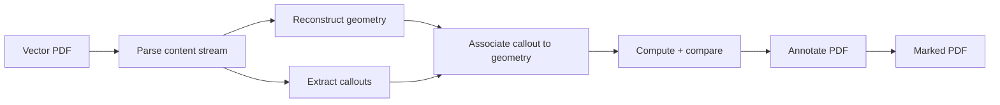

# Civilneer

**Automated QC for civil engineering roadway cross-section drawings.**

[civilneer.com](https://civilneer.com) · Production SaaS · Private beta

Civilneer checks the annotations on a roadway cross-section sheet against the drawing's own underlying geometry, and returns the sheet marked up. A review that takes an engineer 5–10 minutes per sheet by hand runs in under 5 seconds.

> **Note on this repository:** the application source is private. This repo documents the architecture, the engineering decisions behind it, and what the system does. Happy to walk through the codebase in detail on request.

---

## The problem

On a civil roadway plan set, every cross section carries printed callouts: slope percentages, elevations, horizontal offsets. Those numbers are supposed to describe the geometry drawn next to them. Often they don't, because the drawing changed and the annotation didn't, or the annotation was wrong to begin with.

Catching that means an engineer sitting with the sheet and manually verifying each callout against the linework. It's slow, it's tedious, and it's usually done by the most expensive person in the office. Anything missed goes to construction.

## What it does

Upload a vector PDF. Get back the same sheet with every checked callout highlighted:

- **Yellow** — the printed value matches the geometry
- **Red** — the printed value and the geometry disagree, review this

Hovering a highlight shows the measured value, the printed callout, and the difference between them. Nothing is hidden behind a score or a summary table. The engineer sees exactly what the system measured and makes the call.

Published demo run: **3 sheets, 9 cross sections, 86 geometric checks, 6 flagged for review.**

## How it works

**1. Parse.** PyMuPDF reads the PDF content stream directly, pulling out vector path primitives and text spans with their exact positions. No OCR, no rasterization.

**2. Reconstruct geometry.** Path primitives are assembled into Shapely geometries representing the cross-section linework, resolved into consistent coordinate and unit space.

**3. Extract callouts.** Text spans are parsed into typed values: slopes, elevations, horizontal offsets, each with its position on the sheet.

**4. Associate.** Each callout is matched to the geometry it's describing based on its spatial relationship to the linework.

**5. Compute and compare.** NumPy computes the actual value from the matched geometry and compares it to the printed value within tolerance.

**6. Annotate.** Results are written back into the PDF as inspectable highlights carrying the measured value, the printed value, and the delta.

## Architecture

| Layer | Technology |
|---|---|
| Frontend | React, Next.js |
| API | Python, FastAPI, async job handling |
| Auth | OAuth 2.0 |
| Database | PostgreSQL |
| Geometry engine | PyMuPDF, Shapely, NumPy |
| Deployment | Docker Compose on Linux, automated CI/CD |

Built end to end solo: frontend, API, database, geometry engine, PDF pipeline, deployment.

## Engineering decisions

**Vector PDFs only, no OCR.** Reading the content stream gives exact coordinates. OCR gives an estimate. A QC tool that is approximately right is worse than no tool, because it teaches the engineer to trust something that can silently be wrong. The cost of this decision is real: scanned and raster sheets aren't supported, which rules out a meaningful slice of the market. It's the right trade for a tool whose entire value is being correct.

**The output is a marked drawing, not a report.** Engineers already review drawings. Giving them a second artifact to reconcile against the first adds work. Marking up the sheet they were going to look at anyway means adoption costs nothing.

**Findings are inspectable, not asserted.** Every highlight exposes its own inputs. The system never says "this is wrong," it says "here is what I measured, here is what the sheet says, here is the difference." The engineer remains the decision-maker, which is both correct professionally and the only defensible posture for software touching stamped work.

**Asynchronous job handling.** Parsing and geometry work is CPU-bound and varies widely with sheet complexity. The API accepts an upload, returns a job handle immediately, and processes out of band rather than holding a request open.

**Self-hosted on a VPS with Docker Compose.** At beta scale, a managed cloud platform adds cost and a longer data path without solving a problem this system has. Containerizing everything keeps deploys reproducible and single-command, and keeps the whole stack portable if it needs to move later.

**Uploads are deleted after processing.** Drawings are held only as long as the job runs, then removed. They are never used to train or improve models. Plan sets are client-confidential and treating them otherwise would be disqualifying for the buyer.

## Scope and limitations

Stated plainly, because a QC tool that oversells its coverage is a liability:

- Roadway cross sections only
- Vector PDFs only; scanned and raster sheets are not supported
- No integrations. PDF in, PDF out. No Civil 3D, OpenRoads, or ProjectWise plugin
- Web application only; a local/on-prem deployment option is planned

## Status

In private beta with practicing civil engineers, 180+ drawing sheets processed. Free during beta.

---

## Contact

**Abdulrahman (Abdul) Zaghloul**
[abdulrahmanxzaghloul@gmail.com](mailto:abdulrahmanxzaghloul@gmail.com) · [LinkedIn](https://linkedin.com/in/Abdul-Zaghloul) · [civilneer.com](https://civilneer.com)
